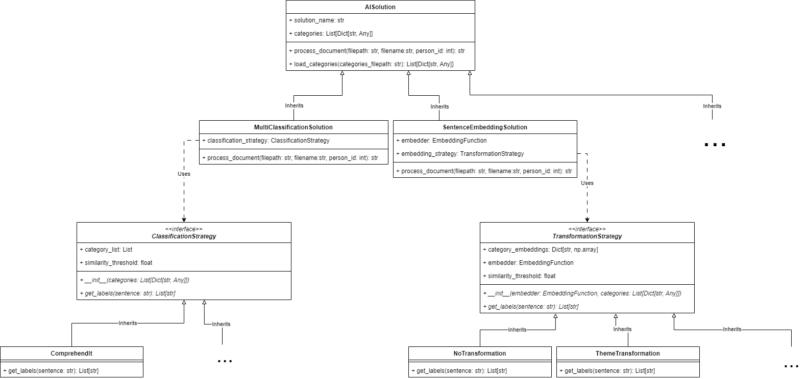
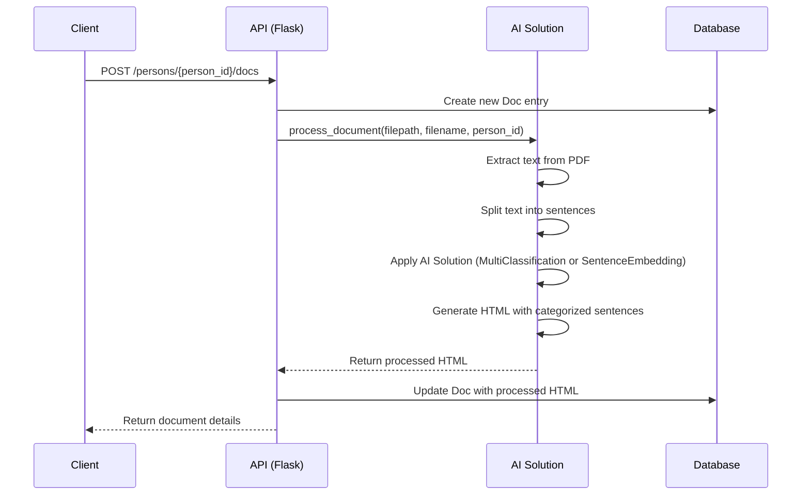

# AI-Text-Classification-App
An app to classify and highlight text chunks from documents into pre-defined categories. 
Allowing the reader to find the snippets of text most relevant to his categories without having to skim through the entire document. 
While maintaining the option to go back to the original source and read the context around the snippet.

## Overview
This project is a Flask-based API with a Angular-based frontend that provides document text-categorization functionality using AI techniques. 
It allows users to manage persons, upload documents, process them using AI, and retrieve categorized snippets based on 
use-case-predefined label categories

## Features
- Person management (create, retrieve)
- Document upload and association with persons
- AI-powered document text-highlighting and sentence labeling
- Retrieval of categorized document snippets
- Label-category management

## Architecture

The application follows a modular architecture with the following main components:

1. Flask API [`app.py`](src/backend/app.py)
2. Database models [`models.py`](src/backend/models.py)
3. AI-Service Logic Modules:
   - [`src/AIServiceLogic/MultiClassification`](src/AIServiceLogic/MultiClassification)
   - [`src/AIServiceLogic/SentenceEmbedding`](src/AIServiceLogic/SentenceEmbedding)


The following diagram provides an overview of the project's architecture:




## AI Solutions

The application supports two AI solutions for document processing:

1. [`MultiClassificationSolution`](src/AIServiceLogic/MultiClassification): Uses a classification strategy to categorize sentences.
2. [`SentenceEmbeddingSolution`](src/AIServiceLogic/SentenceEmbedding): Uses sentence embeddings and transformation strategies 
for categorization.

To switch between solutions, modify the initialization in [`app.py`](src/backend/app.py):

```python
solution: AI_solution = SentenceEmbedder()
# or
solution: AI_solution = MultiClassifier()
```


## Document Processing Flow

The sequence diagram below illustrates the flow of document processing in our application:



## Database Schema
#### Schema
Our application uses the following database schema:

```sql
CREATE TABLE Person (
    person_id INTEGER PRIMARY KEY,
    person_name TEXT NOT NULL,
    person_birthdate DATE
);

CREATE TABLE Doc (
    doc_id TEXT PRIMARY KEY,
    doc_name TEXT NOT NULL,
    doc_path TEXT NOT NULL,
    doc_text_path TEXT,
    doc_text_html TEXT,
    created_at TIMESTAMP DEFAULT CURRENT_TIMESTAMP
);

CREATE TABLE PersonDoc (
    person_id INTEGER,
    doc_id TEXT,
    PRIMARY KEY (person_id, doc_id),
    FOREIGN KEY (person_id) REFERENCES Person(person_id),
    FOREIGN KEY (doc_id) REFERENCES Doc(doc_id)
);

CREATE TABLE LabelCategory (
    label_category_id INTEGER PRIMARY KEY,
    label_category_name TEXT NOT NULL
);
```

#### Models

Our database models are defined in [`models.py`](src/backend/models.py).
For the complete implementation of these models, please refer to the [`models.py`](src/backend/models.py) file 
in the repository.

## Setup and Installation

1. Clone the repository:
   ```
   git clone <repository-url>
   ```

2. Install python dependencies:
   ```
   pip install -r requirements.txt
   ```
   
3. Set up the backend:
   ```cmd
   python -m src.backend.app
   ```
   ```output
   All categories have been successfully created or updated.
   * Serving Flask app 'app'
   * Debug mode: on
   WARNING: This is a development server. Do not use it in a production deployment. Use a production WSGI server instead.
   * Running on all addresses (0.0.0.0)
   * Running on http://127.0.0.1:8001
   * Running on http://192.168.178.72:8001
   Press CTRL+C to quit
   * Restarting with stat
   ```
   
4. Fill up the database with dummy data:
   ```
   python -m src.backend.prefill_database
   ```

5. Install the frontend packages:
   ```
   cd src/front-end
   npm install
   ```
6. Run the frontend application:
   ```
   npm start
   ```
   ```
   Watch mode enabled. Watching for file changes...
   NOTE: Raw file sizes do not reflect development server per-request transformations.
     ➜  Local:   http://localhost:4200/
     ➜  press h + enter to show help
   ```

## API Endpoints
- `/persons`: POST, GET
- `/persons/<int:person_id>`: GET
- `/persons/<int:person_id>/docs`: POST, GET
- `/docs`: GET
- `/docs/<string:doc_id>`: GET
- `/label_categories`: POST, GET
- `/categories/<string:person_id>`: GET
- `/categories/<int:person_id>/<int:category_id>`: GET

For detailed API documentation, please refer to the docstring documentation in [`app.py`](src/backend/app.py).


## Contributing
We welcome contributions to expand and improve this project. Here are some areas where you can contribute:

1. Implementing new AI solutions
2. Creating new transformation strategies for the [`SentenceEmbeddingSolution`](src/AIServiceLogic/SentenceEmbedding)
3. Developing new classification strategies for the [`MultiClassificationSolution`](src/AIServiceLogic/MultiClassification)
4. Improving the existing embedding functions
5. Enhancing documentation and test coverage

Please see our [CONTRIBUTING.md](CONTRIBUTING.md) file for more details on how to contribute.

## License
This project is licensed under the MIT License - see the [LICENSE.md](LICENSE.md) file for details.